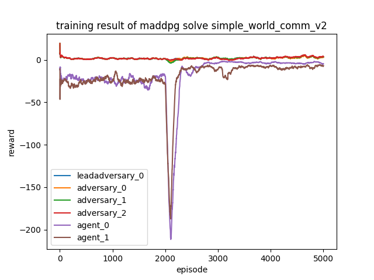
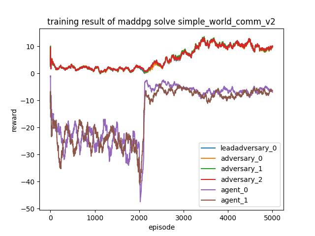

# maddpg with prior data

## Usage

training is done by running `main.py` and testing is done by `evaluation.py`. Below is a basic example of training
using each of the techniques from RLPD combined with MADDPG.

```shell
python main.py simple_tag_v2 --episode_num 5000 # train a simple version to get offline data
python evaluate.py simple_tag_v2 1 -d  # evaluate result saved in folder 1 and save data for offline use
python main.py simple_tag_v2 --episode_num 5000 -o 1 -l --num_qs 5 --num_min_qs 2 --utd 20  # train with offline data
python evaluate.py simple_tag_v2 2  # evaluate result from advanced training
```

more details about arguments can be found in `main.py`, `evaluate.py`
or simply run `python main.py --help`, `python evaluate.py --help`

# Result

| training style                                       | training result                                                  | evaluation result                                                |
|------------------------------------------------------|------------------------------------------------------------------|------------------------------------------------------------------|
| simple_world_comm, no improvements, 5000 steps       |            |            | 
| simple_world_comm, offline data and redq, 5000 steps |  |  | 

# Paper

read more details about this experiment at the paper located in the root of this repo, [`maddpg_prior_data.pdf`](maddpg_prior_data.pdf).